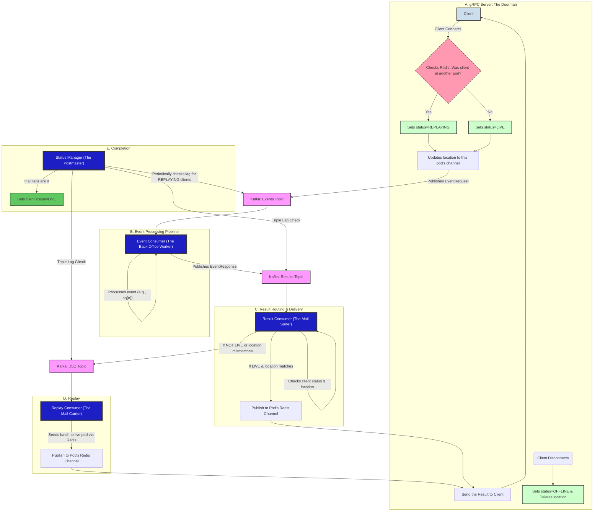

# NimbusGRPC [](https://deepwiki.com/learningfun-dev/NimbusGRPC)

NimbusGRPC is a high-throughput, scalable event processing system built using **gRPC**, **Kafka**, and **Redis**. Designed for mobile and IoT workloads, it provides a hybrid real-time communication layer using bi-directional streaming and a robust pub/sub architecture. This project demonstrates an advanced, production-grade architecture that guarantees ordered message delivery, even when clients disconnect and reconnect across a distributed fleet of servers.

## Blog Series
This repository is part of a multi-part series that explores the concepts and implementation of building a large-scale, resilient real-time system. Follow the complete journey here:

1. Part 1: [The Real-Time Challenge: Keeping Millions in Sync — Instantly](https://medium.com/@learningFun/the-real-time-challenge-keeping-millions-in-sync-instantly-f0979261acca)
We dive into the core problem of real-time communication at scale, explore different architectures, and introduce the “mail slot” concept with a WebSocket prototype.

1. Part 2: [One Backend, Two Fronts: Unifying Real-Time for Web, Mobile & IoT with Nimbus](https://medium.com/@learningFun/one-backend-two-fronts-unifying-real-time-for-web-mobile-iot-with-nimbus-bc702997f948)
We propose a unified architecture, introducing gRPC for mobile/IoT alongside WebSockets for the web, all powered by a single, shared backend pipeline.

1. Part 3: [The Unsent Letter — A Guide to Building a Resilient Real-Time System](https://medium.com/@learningFun/the-unsent-letter-a-guide-to-building-a-resilient-real-time-system-e642cedefab6)
We get our hands dirty with the implementation details in this repository—handling client disconnections, managing a Dead-Letter Queue (DLQ), and building a robust replay system to guarantee message delivery.

## Features
- ✅ Bi-directional gRPC Streaming: High-performance, low-latency communication ideal for mobile and IoT clients.
- 📡 Decoupled Event Processing: Uses a multi-stage Kafka pipeline to decouple event ingestion from processing, ensuring durability and scalability.
- 🔄 Guaranteed, Ordered Message Replay: A robust "Dead-Letter Queue" (DLQ) and replay mechanism ensures clients receive every missed message in the correct order upon reconnection.
- ⚙️ Fault-Tolerant Reconnection Handling: Clients can disconnect and reconnect to any server pod without data loss, with the system automatically managing their state and replaying missed messages.
- 🚀 High-Performance Pipelined Replay: The replay consumer uses a concurrent, pipelined approach to clear backlogs at high speed.
- 🧩 Modular, Microservice-based Design: The system is broken down into independent, scalable services (gRPC Server, Event Processors, Replay Service).
- 📜 End-to-End Event Tracing: A structured logging mechanism is built into the message payload to trace an event's journey through the entire system.
- 🛠️ Centralized Configuration: Manages all application settings via a .env file or environment variables.

## Architecture Overview

The core challenge this architecture solves is guaranteeing message delivery in an ephemeral, distributed environment where clients disconnect and server pods can be scaled up or down at any time. We solve this by treating our system like a resilient post office with a clear separation of roles.



### The Roles Explained

- **The gRPC Server (The Doorman)**: Manages the "front door." When a client connects, it checks their status. If they've moved from another pod, it marks them as REPLAYING to trigger the backlog delivery. When they disconnect, it marks them as OFFLINE.
- **The Event Consumer (The Back-Office Worker)**: The first stage of processing. It consumes from the events-topic, performs the core business logic (e.g., calculates a result), and passes the processed message to the results-topic.
- **The Result Consumer (The Mail Sorter)**: A fast, stateless router. It reads from the results-topic and sorts the "mail." If the recipient client is LIVE, it sends the message to them via their pod's live Redis channel. If not, it diverts the message to the DLQ Topic.
- **The Replay Consumer (The Diligent Mail Carrier)**: A high-performance, pipelined consumer that drains the DLQ Topic. It sends batches of messages to reconnected clients and waits for acknowledgements to guarantee delivery.
- **The Status Manager (The Postmaster General)**: The system's coordinator. It runs periodically and is the only component that can declare a replay complete. It performs a "Triple Lag Check" across the entire pipeline. Only when the lag for a client's partition is zero in the events-topic, results-topic, AND dlq-topic does it safely transition the client's status back to LIVE.


## Key Files & Packages

-   **`nimbus/cmd/`**: Contains the main.go files for the runnable applications:
- - `server/`: The main gRPC server.
- - `kafkaconsumers/`: Runs the EventConsumer and ResultConsumer.
- - `kafkareplay/`: Runs the ReplayConsumer and StatusManager janitor.
- - `client/`: Sample gRPC client implementation demonstrating how to connect, send metadata, and handle bidirectional streams with the NimbusService.
- **`nimbus/common/`**: Shared utilities, including the structured event tracing logic.
- **`nimbus/config/`**: Centralized configuration management.
- **`nimbus/constants/`**: Shared constants for Redis keys and statuses.
- **`nimbus/kafkaconsumer/`**: Contains the logic for all four consumers.
- **`nimbus/kafkaadmin/`**: Kafka Admin Client utilities, used by the StatusManager.
- **`nimbus/kafkaproducer/`**`: Manages the singleton Kafka producer instance.
- **`nimbus/logger/`**: The zerolog-based structured logging module.
- **`nimbus/proto/`**: Protobuf definitions for gRPC services and messages.
- **`nimbus/redisclient/`**: Handles Redis client lifecycle and provides functions for Pub/Sub and key-value operations.

## How to Run

1.  **Clone the repo:**
    ```bash
    git clone [https://github.com/learningfun-dev/NimbusGRPC.git](https://github.com/learningfun-dev/NimbusGRPC.git)
    cd NimbusGRPC
    ```

1.  **Install dependencies:**
    Ensure Go is installed. Then, fetch the Go module dependencies.
    ```bash
    go mod tidy
    ```

1.  **Set up external services (Redis & Kafka):**
    Make sure Redis and Kafka are running and accessible. You can use Docker Compose for a quick setup:
    ```bash
    docker compose --profile dev up -d
    ```
    Ensure the connection details in your configuration (or environment variables) match your Redis and Kafka setup.

1.  **Configure Environment Variables (Optional but Recommended):**
   The application uses environment variables for configuration (see `nimbus/config/config.go`). You can set these in your shell, or for easier management during development, update the `.env` file in the root of your project.

    **Example `.env` file:**
    ```env
    NIMBUS_PORT=50051
    NIMBUS_REDIS_ADDRESS="localhost:6379"
    NIMBUS_KAFKA_BROKERS="localhost:9092"
    NIMBUS_REDIS_EVENTS_CHANNEL="events_results_nimbus_pod_001"
    NIMBUS_KAFKA_EVENTS_TOPIC="nimbus-events-v1"
    NIMBUS_KAFKA_RESULTS_TOPIC="nimbus-results-v1"
    NIMBUS_KAFKA_DLQ_TOPIC="nimbus-dlq-v1"
    NIMBUS_SHUTDOWN_TIMEOUT_SEC=20
    ```

    

1.  **Build the applications:**
    The provided `Makefile` (or your build process) should build the gRPC server, the Kafka consumers service, and the sample client.
    ```bash
    make nimbus
    ```
    This command should create executables, for example, in a `bin/` directory:
    * `./bin/nimbus/cmd/server` (The gRPC server)
    * `./bin/nimbus/cmd/kafkaconsumer` (The combined Kafka consumer service)
    * `./bin/nimbus/cmd/kafkareplay` (The Kafka replay service)
    * `./bin/nimbus/cmd/client` (The sample gRPC client)

1.  **Terminal 1: Start the gRPC server:**
    ```bash
    ./bin/nimbus/cmd/server
    ```
    This starts the NimbusService, listening for incoming gRPC connections. It will publish received events to the `NIMBUS_KAFKA_EVENTS_TOPIC` and subscribe to Redis on `NIMBUS_REDIS_EVENTS_CHANNEL` for results.

1.  **Terminal 2: Start the Kafka consumer service:**
    ```bash
    ./bin/nimbus/cmd/kafkaconsumer
    ```
    This service runs two consumers:
    * **Event Consumer**: Reads from `NIMBUS_KAFKA_EVENTS_TOPIC`, processes events (e.g., for an "sq" event, it calculates the square of the number), and publishes a `KafkaEventResponse` to `NIMBUS_KAFKA_RESULTS_TOPIC`.
    * **Result Consumer**: Reads the `KafkaEventResponse` from `NIMBUS_KAFKA_RESULTS_TOPIC` and publishes it to the Redis channel specified in the message's `RedisChannel` field (which should match what the gRPC server is listening on).

1. **Terminal 3: Start the Replay Service:**
    ```bash
    ./bin/nimbus/cmd/kafkareplay
    ```
    This service runs two critical components responsible for message durability and client state recovery:
    - **Replay Consumer**: Subscribes to NIMBUS_KAFKA_DLQ_TOPIC and delivers missed messages to clients who have reconnected. It processes messages in high-throughput batches and waits for acknowledgements from the clients to ensure guaranteed, ordered delivery.
    - **Status Manager**: Monitors replay progress across all topics. It periodically performs a "Triple Lag Check" on `NIMBUS_KAFKA_EVENTS_TOPIC`, `NIMBUS_KAFKA_RESULTS_TOPIC` and `NIMBUS_KAFKA_DLQ_TOPIC`. Only when all three lags are zero for a client does it safely mark them as `LIVE`, completing the replay cycle.

1.  **Terminal 4: Start the gRPC client (example):**
    ```bash
    ./bin/nimbus/cmd/client --client_id=client_test_001 --start=1 --end=10
    ```
    This will start the sample client, which connects to the gRPC server. It sends a `client_id` in the metadata and then streams a series of "sq" event requests for numbers from `--start` to `--end`. The client will then wait to receive processed results back from the server on the same stream.

    You can run multiple client instances with different `client_id` values.

## Requirements

-   Go (version 1.20+ recommended)
-   Redis (running instance)
-   Kafka (running instance with topics created or auto-creation enabled)
-   Protocol Buffer Compiler (`protoc`) for regenerating Go code from `.proto` files if you modify them.


