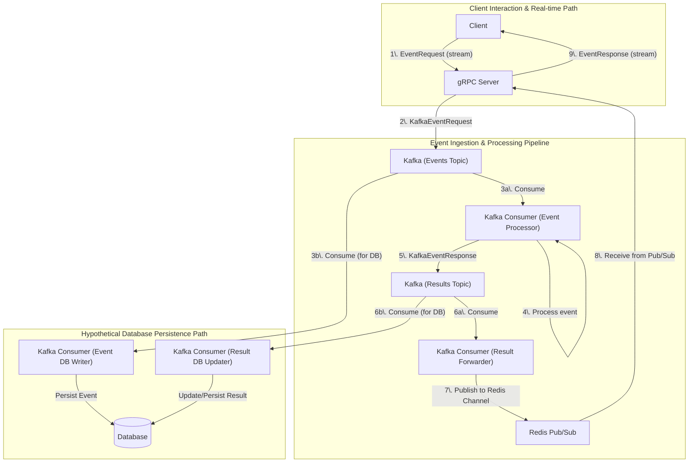

# NimbusGRPC

NimbusGRPC is a high-throughput, scalable event processing system built using **gRPC**, **Kafka**, and **Redis**. Designed for mobile and IoT workloads, it provides a hybrid real-time communication layer using bi-directional streaming and a robust pub/sub architecture.

## Features

- ✅ Bi-directional gRPC stream handling for real-time client-server communication.
- 🚀 Redis-based fan-out with pub/sub for distributing processed results back to the correct server instance.
- 📡 Kafka integration for scalable, durable, and ordered event ingestion and processing.
- ⚙️ Centralized configuration management.
- 🧩 Modularized Kafka producer, Kafka consumers, and Redis client components.
- 📲 Client ID-based stream routing for sending real-time responses to specific clients.
- 🔐 Thread-safe stream management on the gRPC server.
- 🔄 Two-stage Kafka processing pipeline:
    1.  Event ingestion and initial processing (e.g., "sq" operation).
    1.  Result forwarding to Redis for client notification.

## Architecture Overview

Here's a diagram illustrating the flow of events within the NimbusGRPC system:


This diagram shows:

### Core Real-time Flow:

1. The **Client** sends an `EventRequest` via a gRPC stream to the gRPC Server.
1. The **gRPC Server** publishes a corresponding `KafkaEventRequest` to the Kafka (Events Topic).
1. The **Kafka Consumer (Event Processor) (3a)** consumes this request from the events topic.
1. The **Event Processor** performs the necessary computation (e.g., squaring a number).
1. The **Event Processor** publishes a `KafkaEventResponse` (containing the result) to the **Kafka (Results Topic)**.
1. **The Kafka Consumer (Result Forwarder) (6a)** consumes this response from the results topic.
1. The **Result Forwarder** publishes the processed event details to a specific **Redis** channel (indicated in the message).
1. The **gRPC Server** (which is subscribed to the relevant Redis channels) receives the processed event from Redis.
1. The **gRPC Server** sends the final `EventResponse` back to the original Client over the established gRPC stream.

### Hypothetical Database Persistence Flow:

1. Alongside the main processing, a **Kafka Consumer (Event DB Writer) (3b)** could also consume from the `Kafka (Events Topic)` to persist the raw incoming events into a Database.
1. Similarly, a **Kafka Consumer (Result DB Updater) (6b)** could consume from the `Kafka (Results Topic)` to update the database with the processed results or store them.

## Key Files & Packages

-   **`nimbus/client/`**: Sample gRPC client implementation demonstrating how to connect, send metadata, and handle bidirectional streams with the NimbusService.
-   **`nimbus/config/`**: Centralized configuration management for the application, loading settings from environment variables or defaults.
-   **`nimbus/kafkaconsumer/`**: Contains the logic for two distinct Kafka consumers:
    -   `event_consumer.go`: Consumes raw events from `KafkaEventsTopic`, processes them (e.g., performs calculations like squaring a number), and publishes results to `KafkaResultsTopic`.
    -   `result_consumer.go`: Consumes processed results from `KafkaResultsTopic` and publishes them to the appropriate Redis channel for fan-out to the gRPC server instances.
-   **`nimbus/kafkaproducer/`**: Manages the Kafka producer instance, providing functions to publish messages (both event requests and event responses) to specified Kafka topics.
-   **`nimbus/proto/`**: Contains the Protobuf definitions (`.proto` files) for the gRPC service (`NimbusService`) and the message types (`EventRequest`, `EventResponse`, `KafkaEventRequest`, `KafkaEventResponse`).
-   **`nimbus/redisclient/`**: Handles the Redis client lifecycle (initialization, access, closing) and provides functionalities for publishing messages (`publisher.go`) and subscribing to channels (`subscriber.go` - used by the gRPC server).
-   **`nimbus/server/`**: Core gRPC server implementation (`main.go`, `events.go`). It handles incoming client connections, manages client streams, forwards events to Kafka (via `kafkaproducer`), and subscribes to Redis (via `redisclient`) to receive processed results and send them back to the appropriate clients.
-   **`nimbus/cmd/kafkaconsumers/main.go`**: The main application executable for running both the `EventConsumer` and `ResultConsumer`.
-   **`nimbus/cmd/server/main.go`**: The main application executable for running the gRPC server.
-   **`nimbus/cmd/client/main.go`**: The main application executable for running the sample gRPC client.


## How to Run

1.  **Clone the repo:**
    ```bash
    git clone [https://github.com/learningfun-dev/NimbusGRPC.git](https://github.com/learningfun-dev/NimbusGRPC.git)
    cd NimbusGRPC
    ```

1.  **Install dependencies:**
    Ensure Go is installed. Then, fetch the Go module dependencies.
    ```bash
    go mod tidy
    ```

1.  **Set up external services (Redis & Kafka):**
    Make sure Redis and Kafka are running and accessible. You can use Docker Compose for a quick setup:
    ```bash
    docker compose --profile dev up -d
    ```
    Ensure the connection details in your configuration (or environment variables) match your Redis and Kafka setup.

1.  **Configure Environment Variables (Optional but Recommended):**
   The application uses environment variables for configuration (see `nimbus/config/config.go`). You can set these in your shell, or for easier management during development, update the `.env` file in the root of your project.

    **Example `.env` file:**
    ```env
    NIMBUS_PORT=50051
    NIMBUS_REDIS_ADDRESS="localhost:6379"
    NIMBUS_KAFKA_BROKERS="localhost:9092"
    NIMBUS_REDIS_EVENTS_CHANNEL="events_results_nimbus_pod"
    NIMBUS_KAFKA_EVENTS_TOPIC="nimbus-events-v1"
    NIMBUS_KAFKA_RESULTS_TOPIC="nimbus-results-v1"
    NIMBUS_SHUTDOWN_TIMEOUT_SEC=20
    ```

    

1.  **Build the applications:**
    The provided `Makefile` (or your build process) should build the gRPC server, the Kafka consumers service, and the sample client.
    ```bash
    make nimbus
    ```
    This command should create executables, for example, in a `bin/` directory:
    * `./bin/nimbus/cmd/server` (The gRPC server)
    * `./bin/nimbus/cmd/kafkaconsumer` (The combined Kafka consumer service)
    * `./bin/nimbus/cmd/client` (The sample gRPC client)

1.  **Start the gRPC server:**
    ```bash
    ./bin/nimbus/cmd/server
    ```
    This starts the NimbusService, listening for incoming gRPC connections. It will publish received events to the `NIMBUS_KAFKA_EVENTS_TOPIC` and subscribe to Redis on `NIMBUS_REDIS_EVENTS_CHANNEL` for results.

1.  **Start the Kafka consumer service:**
    ```bash
    ./bin/nimbus/cmd/kafkaconsumer
    ```
    This service runs two consumers:
    * **Event Consumer**: Reads from `NIMBUS_KAFKA_EVENTS_TOPIC`, processes events (e.g., for an "sq" event, it calculates the square of the number), and publishes a `KafkaEventResponse` to `NIMBUS_KAFKA_RESULTS_TOPIC`.
    * **Result Consumer**: Reads the `KafkaEventResponse` from `NIMBUS_KAFKA_RESULTS_TOPIC` and publishes it to the Redis channel specified in the message's `RedisChannel` field (which should match what the gRPC server is listening on).

1.  **Start the gRPC client (example):**
    ```bash
    ./bin/nimbus/cmd/client --client_id=client_test_001 --start=1 --end=10
    ```
    This will start the sample client, which connects to the gRPC server. It sends a `client_id` in the metadata and then streams a series of "sq" event requests for numbers from `--start` to `--end`. The client will then wait to receive processed results back from the server on the same stream.

    You can run multiple client instances with different `client_id` values.

## Requirements

-   Go (version 1.20+ recommended)
-   Redis (running instance)
-   Kafka (running instance with topics created or auto-creation enabled)
-   Protocol Buffer Compiler (`protoc`) for regenerating Go code from `.proto` files if you modify them.
