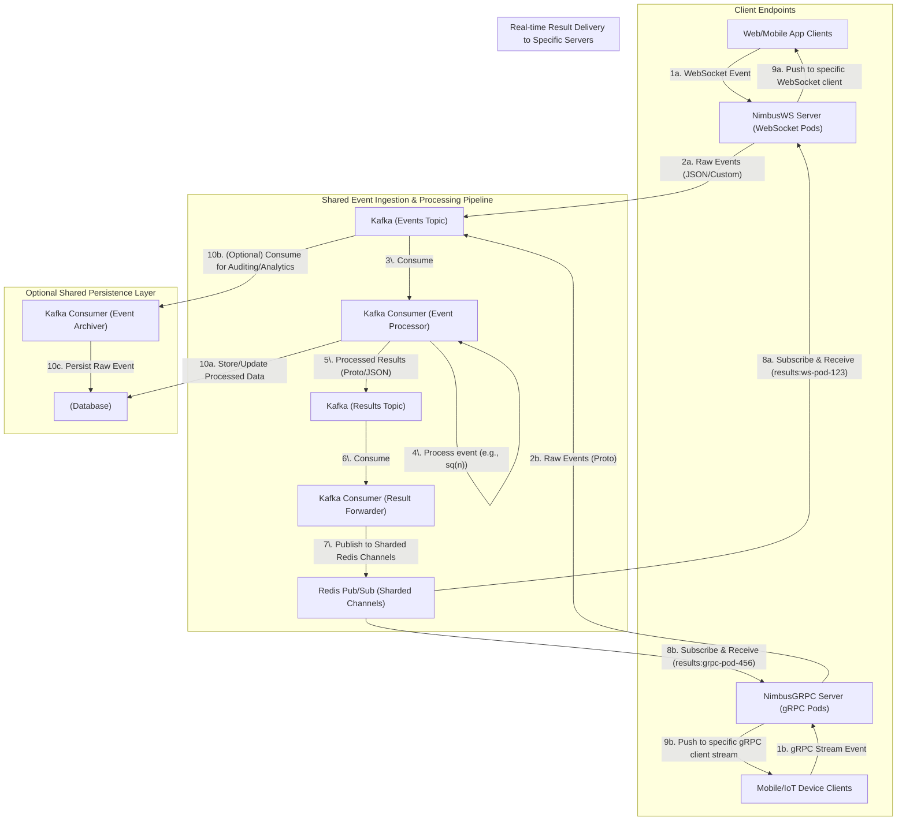

```mermaid
graph TD
    subgraph "Client Endpoints"
        WebMobileClient["Web/Mobile App Clients"] -- "1a. WebSocket Event" --> NimbusWSServer["NimbusWS Server (WebSocket Pods)"]
        MobileIoTClient["Mobile/IoT Device Clients"] -- "1b. gRPC Stream Event" --> NimbusGRPCServer["NimbusGRPC Server (gRPC Pods)"]
    end

    subgraph "Shared Event Ingestion & Processing Pipeline"
        NimbusWSServer -- "2a. Raw Events (JSON/Custom)" --> KafkaEvents["Kafka (Events Topic)"]
        NimbusGRPCServer -- "2b. Raw Events (Proto)" --> KafkaEvents
        KafkaEvents -- "3\. Consume" --> EventProcessor["Kafka Consumer (Event Processor)"]
        EventProcessor -- "4\. Process event (e.g., sq(n))" --> EventProcessor
        EventProcessor -- "5\. Processed Results (Proto/JSON)" --> KafkaResults["Kafka (Results Topic)"]
        KafkaResults -- "6\. Consume" --> ResultForwarder["Kafka Consumer (Result Forwarder)"]
        ResultForwarder -- "7\. Publish to Sharded Redis Channels" --> Redis["Redis Pub/Sub (Sharded Channels)"]
    end

    subgraph "Real-time Result Delivery to Specific Servers"
        Redis -- "8a. Subscribe & Receive (results:ws-pod-123)" --> NimbusWSServer
        NimbusWSServer -- "9a. Push to specific WebSocket client" --> WebMobileClient

        Redis -- "8b. Subscribe & Receive (results:grpc-pod-456)" --> NimbusGRPCServer
        NimbusGRPCServer -- "9b. Push to specific gRPC client stream" --> MobileIoTClient
    end

    subgraph "Optional Shared Persistence Layer"
        EventProcessor -- "10a. Store/Update Processed Data" --> Database["(Database)"]
        KafkaEvents -- "10b. (Optional) Consume for Auditing/Analytics" --> EventDBWriter["Kafka Consumer (Event Archiver)"]
        EventDBWriter -- "10c. Persist Raw Event" --> Database
    end
```
